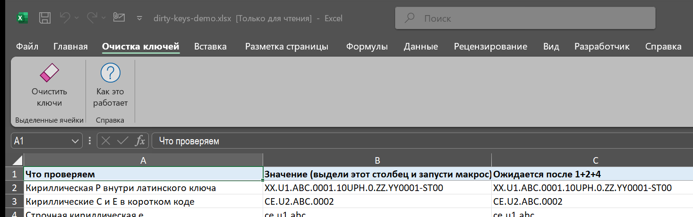

# excel-key-cleaner

Надстройка Excel, которая чистит коды и ключи в выделенных ячейках: кириллические буквы,
набранные вместо похожих латинских (`10UРH` → `10URH`), переносы строк, невидимые символы и
лишние пробелы. Сделана для таблиц, где ключи оборудования и работ копируются между системами
руками и потом не сходятся в `ВПР`/Power Query, потому что «одинаковые» строки различаются
одной русской буквой или неразрывным пробелом.



## Что нужно

**Только Excel 2016 или новее на Windows** и один файл — `excel-key-cleaner.xlam` со [страницы
релизов](https://github.com/MShkolenko/excel-key-cleaner/releases). Ни Python, ни PowerShell, ни
установщика. В коде нет ничего новее Excel 2010 и нет `Declare`-вызовов, поэтому подходит и
32-битный Office. Проверено на Excel 2024 x64, Windows 11 ru-RU.

Python и PowerShell в репозитории есть — но **только для разработки**: `build.py` собирает
`dist/` и надстройку из `src/`, `tests/` гоняют макрос через Excel, `examples/make_demo.py`
сгенерировал демо-книгу. Всё, что они производят, уже лежит в репозитории готовым.

## Что делает

Выделяете ячейки → вкладка **«Очистка ключей» → «Очистить ключи»** (или правая кнопка по
выделению → «Очистить ключи») → форма с пятью флажками:

| # | Действие | Что именно |
|---|---|---|
| 1 | Кириллица → латиница | `А В Е К М Н О Р С Т Х` и строчные `а е о р с х` → `A B E K M H O P C T X a e o p c x`. Решение — **по словам**: слово — кусок между пробелами, переносами, скобками, запятыми, точкой с запятой и кавычками (дефис, точка, `/` и невидимые символы слово не делят — на них держатся коды и координаты). Слово меняется, если «похоже на код» (есть цифра, есть латинская буква, латинских не меньше кириллических, вся кириллица — из этого списка) **само слово** или **вся ячейка**. Так чинится и код посреди русской фразы (`Опора XX.0120.10UМА` → `Опора XX.0120.10UMA`), и английский текст, набранный с кириллическими буквами (`Air сompressed 12 bar`). **Русское слово** — только кириллица, без латиницы и цифр, и в нём есть строчная буква — не меняется никогда: `Насос XX.0120.10UMA` остаётся как есть. Где кириллица осталась, ячейка посчитана в отчёте. Русский текст — только числом; выделяются на листе подозрительные: латиница и кириллица в одном слове (`СЕ.U1`, `Cекция`) — похоже на код, за который правило не взялось; если это коды — повторный запуск на том же выделении с флажком 5. Пределы правила: русское слово ЗАГЛАВНЫМИ рядом с длинным кодом (`ВЕТЕР XX.0120.10UMA`) станет `BETEP`; слово, приклеенное к коду без пробела (`Насос-XX.0120.10UMA`, `4-х/Safety`), решается целиком; короткий ключ вроде `СЕ.U1` (кириллицы больше, чем латиницы) остаётся. `У/у` намеренно не заменяется: русская «у» и латинская «Y» — разные буквы. |
| 2 | Переносы строк → пробел | `CRLF`, `CR`, `LF`, `U+2028`, `U+2029` |
| 3 | Удалить все пробелы | обычный, табуляция, неразрывный `U+00A0`, `U+1680`, `U+2000–200A`, `U+202F`, `U+205F`, `U+3000`; символы нулевой ширины `U+200B–200D`, `U+2060`, `U+FEFF` удаляются |
| 4 | Нормализация пробелов | те же символы приводятся к обычному пробелу, повторы схлопываются; нулевой ширины — удаляются |
| 5 | В выделении только коды | снимает проверку «похоже на код» из п.1: кириллица меняется везде. Включайте, когда точно знаете, что в выделении одни ключи. Буквы без латинской пары (`Ж`, `Ш`, `У`…) остаются и перечисляются |

**Пробелы и невидимые символы по краям ячейки убираются ВСЕГДА**, при любом наборе флажков: ведущий
пробел в ключе — всегда мусор, а глазами его не видно. Единственное исключение — перенос строки по
краю, когда действие 2 выключено: его оставили намеренно, и макрос его не трогает (соседний пробел
всё равно уходит). Прогон **без единого флажка** законен и делает ровно это — чистит края.

Действия 3 и 4 взаимоисключающие. По умолчанию включены 1, 2, 4; флажок 5 выключен.

## Чего он НЕ делает — и почему это главное

- **Работает строго по выделению.** Это локальный инструмент: что выделили — то и чистится, ни
  одной ячейки за пределами выделения. Целый столбец или `Ctrl+A` — тоже выделение, просто
  пустая часть отбрасывается. Отдельная проба в тестах сторожит ловушку `SpecialCells`,
  который на одиночной ячейке молча расползается на весь лист.
- **Ничего не пропускает молча.** Обрабатываются все текстовые ячейки выделения, включая скрытые
  и отфильтрованные строки и ячейки с разным оформлением символов (оформление правится
  посимвольно — для текста до 255 символов; длиннее Excel посимвольно править не даёт, такая
  ячейка записывается целиком: оформление при этом Excel оставляет **по позициям**, то есть оно
  могло съехать на другие символы, поэтому такая ячейка **посчитана в отчёте и выделена**). Всё, что
  макрос не тронул, **посчитано в отчёте**; то, на что стоит посмотреть, — слово, где смешаны латиница
  и кириллица, заголовок таблицы Excel, объединённая область, выделенная не целиком, — после прогона
  **выделено на листе** (выделение проверяется). Русский текст, который и должен остаться русским, —
  только числом. Адресов в отчёте нет: на листе с сотней тысяч русских ячеек список был шумом.
  Формулы, числа, даты, логические, ошибки (`#Н/Д`) и пустые ячейки не текст — их макрос не
  трогает, но в отчёте показывает, сколько их было. Отбор через
  `SpecialCells(xlCellTypeConstants, xlTextValues)`, поэтому целый столбец или `Ctrl+A`
  обрабатываются за секунды, а не перебором миллиона ячеек.
- **Текст остаётся текстом — и это проверяется.** Запись идёт через формат `@` с возвратом прежнего
  формата, после чего ячейка перечитывается: если в ней оказалось не то или не текст, это ошибка с
  откатом. `00123` не станет числом `123`, `12/03` — датой, `1E5` — `100000`, а `=1 + 1` — формулой.
  (Обычное `cell.Value = s` делает всё перечисленное, см. `docs/AUDIT.md`.)
- **Сначала план, потом запись.** Все новые значения вычисляются до первой записи; заблокированная
  ячейка на защищённом листе — отказ до того, как что-то изменилось; ошибка при записи (или `Ctrl+Break`) — откат
  уже записанных ячеек, каждая перечитывается; rich text возвращается из точной копии. Ошибка
  **после** последней записи не откатывает ничего (ячейки уже проверены), но прибирает за собой и
  называется в отчёте. `ScreenUpdating`, `EnableEvents`, `Calculation`, реакция на `Ctrl+Break`
  возвращаются на любом пути — и **перечитываются**: что вернуть не удалось, написано в отчёте.
- **Крестик, Esc и «Отмена» ничего не меняют.** Макрос продолжает работу только если форма
  закрыта кнопкой «Выполнить» (`Tag = "OK"`). `Enter` = Выполнить.
- **Не транслитерирует.** `Ж` не станет `Zh`, `П` не станет `P`. Это исправление опечаток
  раскладки, а не перевод в латиницу; для транслита есть другие инструменты (см. ниже).
- **Не превращает кириллическую `О` в ноль и `З` в тройку** — без знания структуры ключа это
  угадывание.

Отчёт после запуска: полный учёт выделения (сколько ячеек, из них текстовых, формул, чисел, пустых),
сколько изменено (в том числе с оформлением и в скрытых строках), сколько символов заменено,
переносов и пробелов убрано, сколько ячеек не тронуто и почему — и **выделяет на листе** те, на
которые стоит посмотреть. Адресов в отчёте нет, кроме одного аварийного случая: если не удался откат
ячейки с оформлением символов, отчёт называет, какие ячейки вернуть из временной книги. «Изменений
не найдено» — только если действительно ни одна ячейка не изменилась и смотреть не на что.

## Установка

1. Скачайте `excel-key-cleaner.xlam` со [страницы релизов](https://github.com/MShkolenko/excel-key-cleaner/releases).
2. Правая кнопка на файле → «Свойства» → **«Разблокировать»** → ОК (иначе Excel заблокирует
   макросы файла из интернета).
3. Положите его в `%APPDATA%\Microsoft\AddIns` (вставьте в адресную строку Проводника).
4. Excel → `Файл → Параметры → Надстройки → Надстройки Excel → Перейти…` → галочка
   **«Очистка ключей»** → ОК. Появится вкладка «Очистка ключей».

Пошагово, с объяснением «Разблокировать», надёжными расположениями, обновлением и разбором
типичных ошибок — [`docs/INSTALL.md`](docs/INSTALL.md).

**Без надстройки** — модулями в `PERSONAL.XLSB` или в свою книгу: модуль `Cleaning.bas` и форма
`CleaningForm.frm` + `CleaningForm.frx` из [`dist/`](dist/) (в кодировке cp1251, которую ожидает
редактор VBA; `src/` — те же тексты в UTF-8 для чтения), `Alt+F11` → `File → Import File…` →
оба файла → сохранить → `Alt+F8` → `CleanKeys`. Подробно — способ 2 в `docs/INSTALL.md`.

Точка входа одна — `CleanKeys`. Историческое второе имя `Замена_Кирилицы_С_Выбором` убрано в 3.0:
из-за него макрос показывался в списке Excel дважды. Если на старое имя была назначена кнопка,
её нужно один раз переназначить.

Инструкция для ИИ-агента, которому прислали архив или надстройку:
[`docs/INSTALL-FOR-CLAUDE.md`](docs/INSTALL-FOR-CLAUDE.md). Программная установка модулей (COM,
PowerShell, требует «Доверять доступ к объектной модели проектов VBA») —
`tools/Install-VbaComponents.ps1`.

Заявленный минимум — Excel 2016. Версии 2010–2013, скорее всего, тоже работают (лента надстройки —
формат Office 2010, в коде ничего новее), но на них не проверялось; Excel 2007 и старше — нет: там `SpecialCells` возвращал
неверный результат при более чем 8192 областях (на 2024 измерено 10 000 областей без ошибок).

## Попробовать

[`examples/dirty-keys-demo.xlsx`](examples/dirty-keys-demo.xlsx) — 25 строк с разной «грязью» и
ожидаемым результатом рядом. Выделите столбец B, запустите макрос с настройками по умолчанию
и сравните с C. Все коды вымышленные. (Книга уже сгенерирована; `examples/make_demo.py` — её
исходник, запускать не нужно.)

## Тесты (для разработчиков)

Пользователю этот раздел не нужен. В `tests/` — стенд, который прогоняет **настоящий** VBA-код через COM в чистой книге без единого
изменения логики (в копии модуля подменяются две строки: имя модуля и вызов формы, `MsgBox`
перехватывается). 54 входные строки × 8 наборов флажков сверяются с эталонной моделью на Python (запускается на
установленном коде, а не на копии логики), плюс три инварианта по всему набору (с флажком 5 ни в
одной ячейке не остаётся омоглифа, плохого пробела или пробела по краям; с настройками по
умолчанию каждая ячейка с оставленной кириллицей названа в отчёте и попала в итоговое выделение;
ни одна ячейка вне выделения не изменилась),
плюс 45 проб на то, что не выражается строкой (60 автоматических проверок значений; падение
пробы или сломанный инвариант дают `exit 1` — стенд можно ставить в гейт): `#Н/Д` в выделении, `Ctrl+A`, 32 767 символов,
защищённый лист, объединённые ячейки, разрывное выделение, скрытая строка, одиночная ячейка,
rich text (в том числе с `CRLF` при любом наборе флажков, табуляцией, на пределе 255 символов),
заголовок таблицы Excel,
гиперссылка, апостроф-префикс, дата-время, текст `=1 + 1`, целый столбец с таймером — и
**откат по-настоящему**: в тестовую копию модуля внедряется ошибка записи, после чего проверяется,
что всё вернулось, включая оформление rich-ячейки и уже изменённую объединённую область, — и
**путь после записи**: ошибка там не откатывает уже очищенные ячейки, но закрывает временную
книгу, возвращает состояние Excel и называет себя в отчёте, — и **переполнение отчёта**: когда
предупреждений столько, что окно их не вмещает, аварийный блок показывается отдельным окном
первым.

```powershell
python tests\gen.py dist\Cleaning.bas out --v2
powershell -File tests\Run-CleaningAudit.ps1 -AuditDir out -FormDir dist
python tests\verify.py out            # ожидается: mirror agreement: 432 OK, 0 MISMATCH; invariants: all OK
powershell -File tests\Measure-Speed.ps1 -DistDir dist   # необязательно, ~2 минуты: 8k/20k/40k ячеек
python tests\measure_left.py dist                        # гейт: тысячи несоседних ячеек, которые надо назвать и выделить (exit 1 при сверхлинейном росте)
python build.py                                          # пересобрать dist/ и надстройку (нужен Excel)
python tests\verify_xlam.py dist --png docs\ribbon.png   # надстройка: код внутри = dist/, лента грузится, снимок ленты
type out\special.txt                  # исход каждой пробы
```

Нужны Windows, Excel, Python 3 и включённый доступ к объектной модели VBA. Стенд ничего не
сохраняет и не трогает файлы на диске.

## Лицензия

MIT — пользуйтесь и меняйте свободно, без гарантий.
